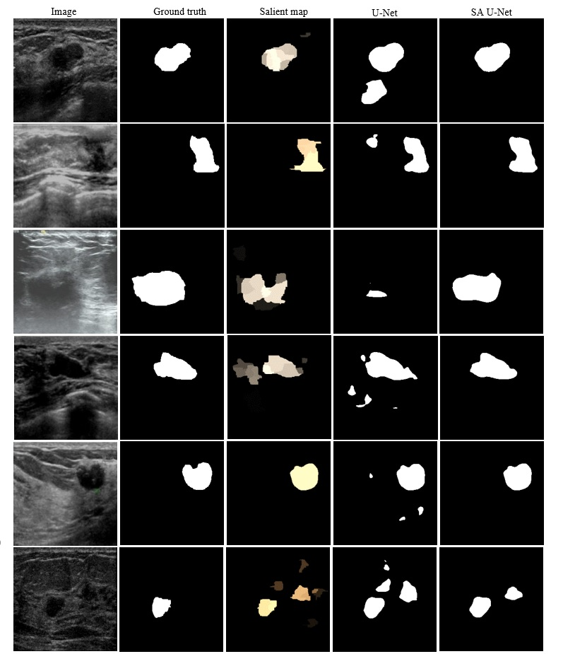
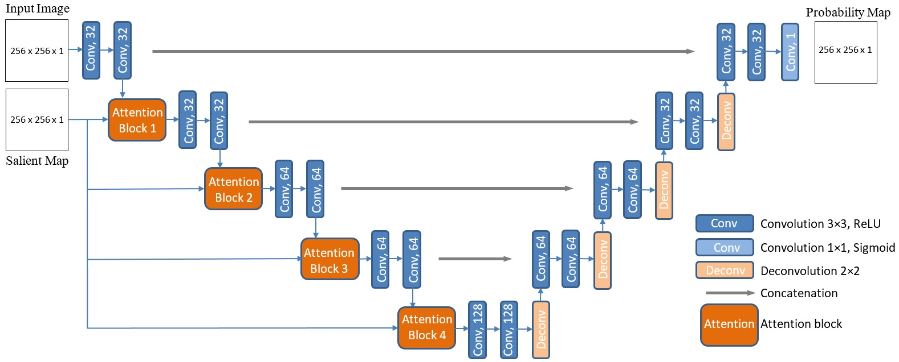
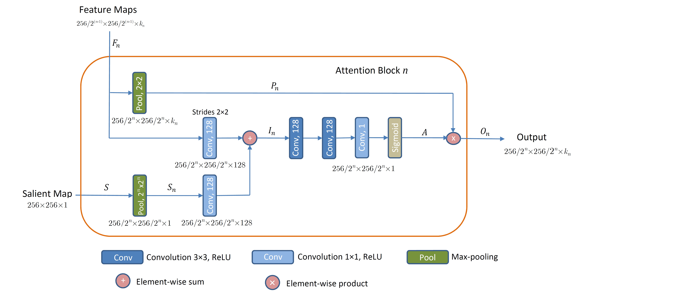

# Attention-Enriched-Deep-Learning-Model-for-Breast-Tumor-Segmentation-in-Ultrasound-Images

The codes in this repository are based on our work presented in the paper <a href="https://arxiv.org/abs/1910.08978">Attention Enriched Deep Learning Model for Breast Tumor Segmentation in Ultrasound Images</a>. 

An important avenue for improved performance of data-driven models is via incorporating prior domain-specific knowledge. Incorporating prior knowledge in deep models for breast cancer detection is challenging, because unlike other medical organs—such as the kidney or the heart, whose features naturally lend themselves to the application of shape or boundary priors—breast tumors have large variability in shape and boundaries from case to case. Extracting other priors in the form of curvature, texture, intensity, or number of regions for breast tumors is also not an option.

In this work, we propose a new approach to integrating visual saliency into a deep learning model for breast tumor segmentation in ultrasound images. Visual saliency refers to image maps containing regions that are more likely to attract radiologists’ visual attention. The proposed approach introduces attention blocks into a
U-Net architecture and learns feature representations that prioritize spatial regions with high saliency levels. The validation results indicate increased accuracy for tumor segmentation relative to models without salient attention layers.

# Codes
Jupyter notebooks present the implementation of the proposed approach using Keras and Tensorflow libraries.
* <a href="Codes/UNet.ipynb">UNet</a> [<a href="https://nbviewer.jupyter.org/github/avakanski/Attention-Enriched-DL-Model-for-Breast-Tumor-Segmentation/blob/main/Codes/UNet.ipynb">on nbviewer</a>] - implementation of the standard U-Net model for breast tumor segmentation. U-Net is used as a baseline model for evaluation of our approach.
* <a href="Codes/UNet_SA.ipynb">UNet_SA</a> [<a href="https://nbviewer.jupyter.org/github/avakanski/Attention-Enriched-DL-Model-for-Breast-Tumor-Segmentation/blob/main/Codes/UNet_SA.ipynb">on nbviewer</a>] - our proposed Salient Attention U-Net model. It applies attention blocks to saliency maps of breast ultrasound images. 
* <a href="Codes/UNet_SA_C.ipynb">UNet_SA_C</a> [<a href="https://nbviewer.jupyter.org/github/avakanski/Attention-Enriched-DL-Model-for-Breast-Tumor-Segmentation/blob/main/Codes/UNet_SA_C.ipynb">on nbviewer</a>] - our proposed Salient Attention U-Net model applied on saliency maps of breast ultrasound images with only one contour with the highest saliency extracted in each map.

# Segmentation Results
The figure shows the segmentation results for several images. First column: original breast ultrasound image. Second column: ground truth mask. Third
column: saliency map. Fourth column: segmentation mask produced by U-Net. Fifth column: segmentation mask produced by Salient Attention U-Net.

  

# Network Architecture
The architecture of the proposed Salient Attention U-Net model. The network uses breast ultrasound images and saliency maps as inputs, and produces segmentation probability maps as outputs. Conv = convolution; Deconv = deconvolution.

# Salient Attention Block
The proposed attention block n for n = {1, 2, 3, 4} is shown. Inputs to the block are feature maps from layer n and a salient map, whereas the output constitutes downsampled feature maps weighted with the attention coefficients.

# Citation
If you use the codes or the methods in your work, please cite the following <a href="https://www.sciencedirect.com/science/article/abs/pii/S0301562920302878">article</a>:   

    @ARTICLE{Vakanski2020,
    title={Attention-Enriched Deep Learning Model for Breast Tumor Segmentation in Ultrasound Images},
    author={Vakanski, A. and Xian, M. and Freer, P. E.},
    journal={Ultrasound in Medicine & Biology}, 
    year={2020},
    month={Sep.},
    volume={46},
    number={10}
    pages={2819-2833},
    doi={https://doi.org/10.1016/j.ultrasmedbio.2020.06.015}
    }

# License
<a href="License - MIT.txt">MIT License</a>

# Acknowledgments
This work was supported by the <a href="https://imci.uidaho.edu/get-involved/about-cmci/">Institute for Modeling Collaboration and Innovation (IMCI)</a> at the University of Idaho through NIH Award #P20GM104420.
